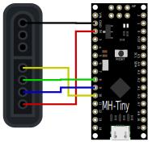

# ATSUC - Atmel ATtiny88 SNES USB controller

Here you will find a small Sunday project to connect a SNES controller to you
PC with an Atmel Attiny88, which can be purchased for around 5 €.

It should run on any Attiny88 (probably also 45 and 85), but is primarily made
for a MH-Tiny, an Arduino Nano „compatible“ device.

Towards the PC it enumerates as an USB HID device using the
[V-USB](https://www.obdev.at/products/vusb/index.html) bitbanging library.

The SNES controller's shift register is also read by bitbanging.

## Building

You will need `make` and `avr-gcc` to build and the micronucleus commandline
interface (if using MH-tiny) to upload the program.

This build instruction focuses on tumbleweed. Debian-bases system should be
similar.

First you'll need to build the `micronucleus` command line interface:

```bash
sudo zypper in git-core make gcc libusb-compat-devel
curl -L https://github.com/micronucleus/micronucleus/archive/refs/tags/v2.6.tar.gz | tar xvz
cd micronucleus-2.6/commandline
sed -i -e 's/-static//g' -e "s|/usr/local|$HOME/.local|g" Makefile
make install
cd -
rm -r micronucleus-2.6
```

Install make and compiler and run `make` now to build. Probably there is a
newer version than gcc 15:

```bash
sudo zypper in avr-libc cross-avr-gcc15
make
```

To upload the program, call the `run` make target:

```bash
make run
```

Clean up the installed RPMs if you don't need them anymore:

```bash
zypper rm -u make git-core make gcc libusb-compat-devel avr-libc cross-avr-gcc15
```

## Hardware connection

You will need to connect 5 wires to the SNES plug:



| GPIO | MH-Tiny Pin | SNES controller PIN | Description |
| --- | --- | ---    | --- |
|  -  | 5V  | 1 | +5V    |
|  -  | GND | 7 | Ground |
| PB0 |  8  | 3 | Latch  |
| PB1 |  9  | 2 | Clock  |
| PB2 | 10  | 4 | Data   |

## Usage and status LED

All activity on the MCU is initiated by USB polling. When there is no USB
activity, the MCU goes to power-down sleep and wakes up every 1s to toggle the
LED.

When there is an USB polling request the SNES controller's shift register is
read and the USB request is answered. This takes aproximately 100 µS.
The CPU goes back to sleep. USB polling is set to 10 ms.

The LED lights up during this process. Then a button is pressed, it stays on.
When no button is pressed, it is turned off until the next polling cycle.

So, the LED tells you the status:

| LED state | Meaning |
| --- | --- |
| Blinking in 1s cycle | No USB activity, CPU is sleeping |
| 1 % on, dim glow | USB activity, no button pressed or no controller connected |
| Constant on | USB activity, button pressed |

After flashing the firmware, your module should blink. Then, start `evtest` or
open the Windows gamepad control panel. The OS should start polling the module,
so the LED must glow dimly. Pressing buttons make the LED light up fully.

## Testing

This was tested with
* Tumbleweed 20250923, Kernel 6.16.8-1-default.
* Microsoft Windows 10.0.19045.2006

## Troubleshooting

* The SNES controller's shift register is way faster than the SNES queries it.
  There are two pulseview files in `logic_analyzer` folder. They show that the
  response time is somewhere at 100 µS. if `TIMING_QUICK` is defined (default),
  latch and clock are clocked at roughly 1 µS.

  Undefine `TIMING_QUICK` if your controller does not respond.

* If `POWERSAVE` is defined (default), the CPU will go to deep sleep between
  USB polls. Resuming from power down takes 6 clock cycles. There is a chance
  that the USB sync pattern is missed.

  Undefine `POWERSAVE` if you experience USB issues.

## Ideas, known bugs and limitations

* Only one gamepad supported. Should be more.
* Additional power saving by switching controller +5 V through a GPIO
* USB re-enumeration is not supported. Enumeration fails when the system is
  rebooted while the ATtiny is plugged in.
